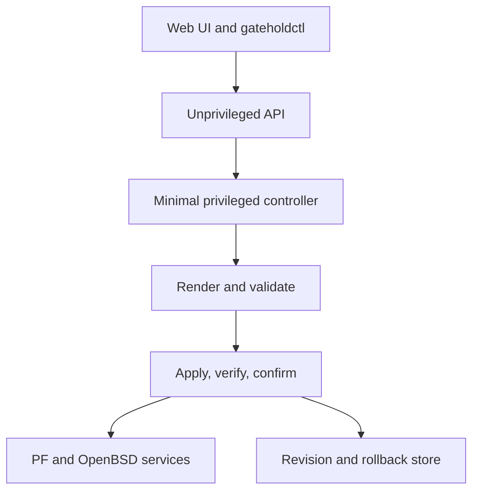

# SASD Gatehold

**OpenBSD-native firewall and secure routing platform written in modern C++.**

SASD Gatehold is an open-source project for building a small, auditable, and
operationally safe network-security appliance on top of OpenBSD. It aims to
combine the proven networking facilities of OpenBSD with transactional
configuration, automatic rollback, structured diagnostics, and optional
privacy-aware log analysis.

> [!IMPORTANT]
> Gatehold is currently in **pre-alpha development**. The repository contains
> the initial buildable project skeleton; it is not yet a functional firewall
> distribution and must not be used to protect production networks.

## Project vision

Traditional firewall interfaces often make configuration convenient but still
leave administrators exposed to lockouts, partial changes, difficult incident
reconstruction, and opaque automation. Gatehold is designed around a stricter
operational model:

1. represent the desired change as structured data;
2. render native OpenBSD configuration into a staging area;
3. validate it with the original OpenBSD tools;
4. preserve the last known-good revision;
5. activate the change atomically wherever possible;
6. verify connectivity and service health;
7. require confirmation for dangerous changes;
8. roll back automatically when confirmation or verification fails.

The central security principle is:

> **A requested goal is not authorization.**

Human administrators, API clients, automation, and future AI-assisted features
receive only the capabilities explicitly granted to them. Analysis and change
preparation do not imply permission to activate a configuration.

## Why OpenBSD?

Gatehold does not intend to replace OpenBSD networking components. It builds a
carefully bounded management layer around them. Planned integrations include:

- PF for stateful filtering, NAT, tables, and traffic policy;
- `pflog` and `tcpdump` for observable packet-filter decisions;
- `rcctl` for service management;
- WireGuard and `iked` for VPN connectivity;
- CARP and pfsync in a later high-availability phase;
- OpenBSD update and package mechanisms;
- process isolation with dedicated users, file permissions, `pledge`, and
  `unveil` where applicable.

Keeping the operating-system base close to upstream reduces the amount of
security-critical code the project must maintain.

## Intended audience

The first releases target:

- homelab operators who want an understandable OpenBSD firewall;
- Linux and BSD administrators who prefer native configuration and automation;
- small organizations that value reviewable changes and dependable recovery;
- security labs exploring tightly controlled agent-assisted administration.

Gatehold is not intended to achieve feature parity with OPNsense or pfSense in
its first releases. A smaller, dependable feature set is more valuable than a
wide but weakly tested one.

## Planned capabilities

The table describes direction, not current availability.

| Area | Planned capability | Initial priority |
|---|---|---:|
| Interfaces | WAN, LAN, static addressing, DHCP client, VLANs | High |
| Firewall | PF rules, aliases, schedules, rule explanation | High |
| Routing | IPv4, basic IPv6, gateways, static routes | High |
| NAT | Outbound NAT and controlled port forwarding | High |
| Local services | DHCP, DNS integration, NTP status | High |
| VPN | WireGuard management | High |
| Safety | Validation, revisions, confirmed commit, rollback | Critical |
| Operations | Dashboard, health checks, backup and restore | High |
| Diagnostics | Structured events, audit trail, support bundles | Critical |
| Automation | REST API and `gateholdctl` | High |
| Updates | Signed packages, migrations, recovery path | Critical |
| Insight | Optional local or external AI-assisted log analysis | Later |
| High availability | CARP, pfsync, configuration synchronization | Later |
| IDS/IPS | Carefully isolated integration | Later |

Explicitly out of scope for the first MVP are a general plugin ecosystem,
wireless access-point management, a captive portal, broad legacy VPN support,
dynamic-routing user interfaces, and automatic AI-controlled rule activation.

## Security architecture

Gatehold separates presentation, orchestration, and privileged execution:



The web process must not receive general root access. Communication with the
privileged controller is planned through a local Unix-domain socket using a
small, versioned protocol. The controller exposes operations rather than a
general command-execution facility.

Dangerous changes such as a LAN address, gateway, interface assignment, or
management-access rule will use a confirmed-commit workflow. Unless the change
is explicitly confirmed within a limited window, Gatehold restores the last
known-good revision.

See [`docs/architecture/`](docs/architecture/) and
[`docs/security/`](docs/security/) for the evolving design record.

## Observability and supportability

Diagnostics are a product feature, not an afterthought. Gatehold will produce
structured events with stable event IDs and correlation IDs while also using
native system logging where appropriate.

Planned diagnostic levels include `error`, `normal`, `verbose`, and temporary
`trace`. Verbose modes must expire automatically to reduce disk usage and the
risk of retaining sensitive metadata.

A future command such as:

```console
doas gateholdctl support collect
```

will create a reviewable and sanitized support bundle containing version,
build, service, validation, and relevant diagnostic information. It must not
contain passwords, private keys, session cookies, API tokens, or packet
payloads. IP and MAC addresses should be optionally pseudonymized while keeping
relationships useful for fault analysis.

## Optional Gatehold Insight

Gatehold Insight is the planned analysis component for correlating firewall,
VPN, DNS, DHCP, authentication, and system events. It is intentionally separate
from the privileged firewall controller.

The initial model is read-only:

- summarize security-relevant activity;
- explain unexpected rule hits and service failures;
- identify recurring anomalies and possible misconfiguration;
- propose diagnostic steps or a candidate change;
- link findings to event, rule, revision, and operation IDs.

No AI component will receive implicit permission to change the active firewall.
External analysis will be opt-in and will receive only explicitly selected,
sanitized event data. Local analysis remains a supported architectural goal.

## Repository layout

```text
SASD-Gatehold/
├── .github/workflows/     Continuous integration
├── docs/                  Architecture and project documentation
│   ├── adr/               Architecture Decision Records
│   ├── architecture/      System boundaries and component design
│   ├── development/       Developer workflows and standards
│   ├── lab/               KVM and physical test-lab guidance
│   ├── reference/         Formats, events, CLI, and API reference
│   ├── security/          Threat model and security design
│   └── user-guide/        Installation and administration guides
├── include/gatehold/      Public C++ interfaces
├── packaging/openbsd/     OpenBSD packaging work
├── src/                   C++ implementation and command-line tools
├── tests/                 Automated tests
└── tools/                 Development and lab automation
```

## Current repository state

The initial milestone provides:

- a C++23 and CMake project baseline;
- the `gatehold_core` library target;
- a minimal, non-privileged `gateholdctl` executable;
- a typed firewall-rule model with stable validation error codes;
- strict validation for rule IDs, descriptions, interfaces, addresses, address
  families, protocols, ports, and duplicate rule IDs;
- a deterministic PF renderer that emits no partial output after a validation
  failure;
- structured JSON event formatting with automatic redaction of attributes whose
  keys indicate passwords, tokens, secrets, private keys, cookies, or
  authorization data;
- a secure, write-once PF candidate store using `openat`, `O_NOFOLLOW`, an
  absolute trusted staging root, and private file permissions;
- a shell-free POSIX process runner with timeout and bounded output capture;
- a native PF validation adapter that invokes `/sbin/pfctl -nf` without loading
  the candidate ruleset;
- an append-only JSONL operation journal with private permissions, file locking,
  durable writes, redaction, and a hard size limit;
- a fail-closed preparation service that connects portable validation,
  rendering, staging, and native validation into one correlated operation;
- an immutable revision store for natively validated PF candidates;
- an atomic, private last-known-good marker that can reference only an existing
  safe revision and is deliberately separate from preparation;
- a shell-free PF loader and an experimental activation coordinator requiring a
  trusted authorization decision, immediate native revalidation, health probes,
  explicit confirmation, and rollback on every ambiguous failure;
- an opt-in OpenBSD integration test for the real `/sbin/pfctl -nf` path;
- positive and negative CTest coverage, including attempted line injection;
- a Linux CI build that treats warnings as errors;
- documentation, contribution, security, and agent guidance.

The project can now prepare an in-memory ruleset as one audited operation:
portable validation, deterministic rendering, private staging, native syntax
validation, and immutable revision storage. Each transition is durably
journaled before the next stage proceeds; an unavailable or unsafe audit journal
fails the operation closed. Automated tests use a controlled `pfctl` substitute.
An opt-in smoke test for the real `/sbin/pfctl` is included but still needs to
run in the OpenBSD lab. The activation transaction exists only as an
experimental library API tested with a controlled substitute: it is not wired
to a privileged controller and has never loaded a real OpenBSD ruleset.
Preparation never advances the last-known-good marker. Gatehold also does not
yet parse persisted administrator configuration.

## Building the current skeleton

### Requirements

- CMake 3.20 or newer;
- a C++23-capable Clang or GCC toolchain;
- a POSIX-like development environment.

The Linux build exists for fast feedback. Native OpenBSD builds and integration
tests are required before a change can be considered suitable for the target
platform.

### Configure, build, and test

```console
git clone https://github.com/Robin-Goerlach/SASD-Gatehold.git
cd SASD-Gatehold
cmake -S . -B build -DCMAKE_BUILD_TYPE=Debug
cmake --build build --parallel
ctest --test-dir build --output-on-failure
./build/src/gateholdctl --version
./build/src/gateholdctl render-example
./build/src/gateholdctl event-example
```

For stricter local builds:

```console
cmake -S . -B build-strict \
  -DCMAKE_BUILD_TYPE=Debug \
  -DGATEHOLD_WARNINGS_AS_ERRORS=ON
cmake --build build-strict --parallel
ctest --test-dir build-strict --output-on-failure
```

## Development and testing model

Development tools run on a Linux workstation or CI host. OpenBSD is the native
target and test environment; the production appliance should not contain Git,
Node.js, compilers, or coding agents.

The planned feedback loop is:

1. build and unit-test portable C++ code on Linux;
2. deploy a test package to a disposable OpenBSD VM;
3. validate native configuration with OpenBSD tools;
4. execute network integration and failure-injection tests;
5. reset the VM to a known snapshot when required;
6. repeat on selected physical reference hardware;
7. create a sanitized support bundle for failures that need analysis.

Production releases will be distributed as versioned, signed artifacts rather
than by pulling source code directly onto a firewall.

## Roadmap

### Phase 0 — Foundations

- product scope, non-goals, and supported hardware policy;
- repository, build, test, and documentation standards;
- threat model and privilege boundaries;
- OpenBSD lab topology and reproducible baseline.

### Phase 1 — Transactional PF prototype

- versioned configuration model;
- minimal PF renderer;
- native syntax validation;
- last-known-good revision storage;
- apply, verify, confirm, and rollback workflow;
- structured operation events and sanitized reports.

### Phase 2 — Local administration

- narrowly scoped controller protocol;
- `gateholdctl` administration commands;
- interface and alias management;
- local authentication and audit trail.

### Phase 3 — Web and core network services

- unprivileged API and web interface;
- NAT, DHCP, DNS, VLAN, and WireGuard workflows;
- backup, restore, diagnostics, and health dashboard.

### Phase 4 — Distribution and public testing

- native OpenBSD packages and signed repository;
- first-boot and recovery workflows;
- schema migrations and system updates;
- documented hardware matrix;
- security review and public beta.

Progress will be tracked through GitHub milestones and issues once the Phase 0
architecture decisions have been accepted.

## Documentation

Start with the [documentation index](docs/README.md). Important areas are:

- [architecture](docs/architecture/README.md);
- [Architecture Decision Records](docs/adr/README.md);
- [security documentation](docs/security/README.md);
- [initial threat model](docs/security/threat-model.md);
- [configuration lifecycle](docs/architecture/configuration-lifecycle.md);
- [development guide](docs/development/README.md);
- [lab guide](docs/lab/README.md);
- [user-guide placeholder](docs/user-guide/README.md);
- [technical reference](docs/reference/README.md);
- [structured event format](docs/reference/event-format.md).
- [native-validation reference](docs/reference/native-validation.md).
- [preparation-operation reference](docs/reference/preparation-operation.md).
- [revision-store reference](docs/reference/revision-store.md).
- [activation-operation reference](docs/reference/activation-operation.md).
- [OpenBSD native smoke test](docs/lab/openbsd-pfctl-smoke-test.md).

Documentation will be maintained in English and German as the project matures.
The code, event IDs, configuration keys, and API names remain language-neutral.

## Contributing

Gatehold is at an early architectural stage. Design discussion, threat
analysis, OpenBSD knowledge, test scenarios, and clear documentation are as
valuable as code. Read [CONTRIBUTING.md](CONTRIBUTING.md) before proposing a
change.

Security-sensitive work should remain small, reviewable, and independently
testable. Features that cannot yet be activated safely should first be built as
render-and-validate or read-only functionality.

## Security reports

Do not disclose suspected vulnerabilities in a public issue. Follow the process
in [SECURITY.md](SECURITY.md). Until the first supported release exists, all
builds are for development and isolated-lab use only.

## License

SASD Gatehold is licensed under the [MIT License](LICENSE).

OpenBSD and third-party components retain their own licenses and copyright
notices. The project will document bundled components and their licenses before
publishing distributable images.

## Project identity

- **Project:** SASD Gatehold
- **Repository:** `Robin-Goerlach/SASD-Gatehold`
- **Primary target:** OpenBSD on amd64 for the first prototype
- **Implementation:** modern C++ with minimal dependencies
- **Status:** pre-alpha, not production-ready

SASD Gatehold is an independent project and is not affiliated with the OpenBSD
project, OPNsense, pfSense, or their respective organizations.
