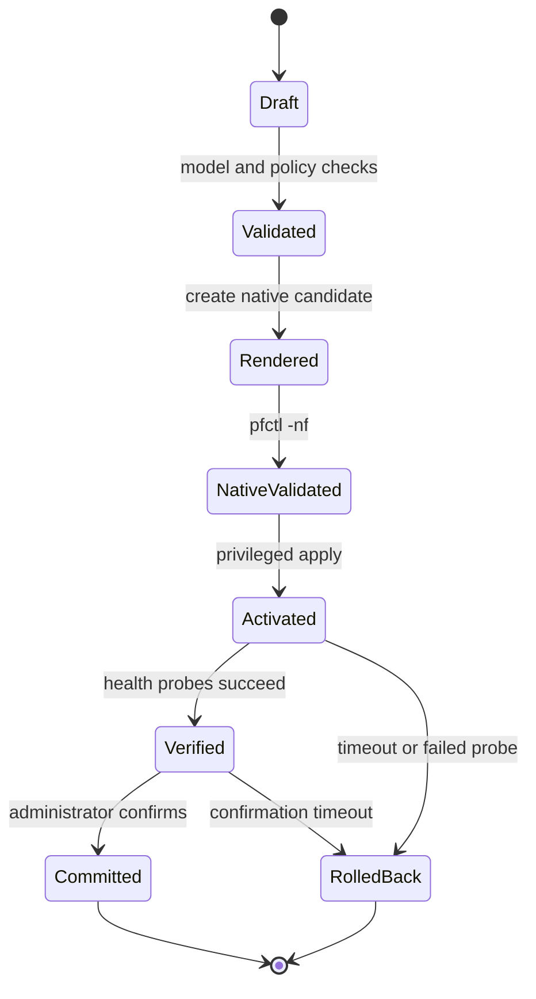

# Configuration lifecycle

Status: **proposed**, with render-time validation partially implemented.

Gatehold treats a configuration change as a transaction with explicit stages.
No caller may skip directly from user input to privileged activation.

## Lifecycle

## Stage guarantees

### Draft

The desired state consists only of versioned, typed Gatehold objects. The
configuration does not accept arbitrary PF text. Every object carries a stable
identifier so validation, audit events, and user-visible errors can refer to the
same subject.

### Model validation

Portable validation rejects malformed or unsafe values before any native file
is created. The current prototype validates rule identifiers, descriptions,
interface names, numeric IP networks, address families, protocol/port
combinations, and duplicate IDs.

Validation is fail-closed: if any issue exists, the PF renderer returns no
candidate text. Stable `GH-CFG-*` codes make failures testable and diagnosable.

### Render

The renderer maps enumerated domain values to known PF tokens. It never copies
an action, direction, family, or protocol from free-form text. Textual fields
that reach output are constrained before rendering. Output is deterministic for
the same ordered input and includes the configuration revision.

### Native validation

On OpenBSD, a future validation adapter will write the candidate to a private,
root-owned staging location and execute `pfctl -nf` without a shell. It will use
an argument vector and a fixed executable path. Successful portable validation
does not replace this native syntax check.

### Activation

Only the small privileged controller may activate a natively validated
candidate. The API and web user interface will request a narrowly scoped
operation over a local socket; they will not receive arbitrary command
execution or filesystem access.

### Verification and confirmation

Health probes will check the expected management path, selected data paths,
PF status, and affected services. High-risk changes enter a pending-confirmation
state with a monotonic deadline.

### Commit or rollback

Explicit confirmation promotes the candidate to the last known-good revision.
A failed probe, controller restart, or expired confirmation timer restores the
previous revision. Rollback must not depend on the web session that requested
the change.

## Audit events

Each transition emits a structured event with an operation ID, stable event ID,
revision, stage, outcome, and sanitized context. Secrets and packet payloads are
never valid event attributes. See the [event-format reference](../reference/event-format.md).

## Current implementation boundary

Implemented now:

- typed in-memory firewall rules;
- portable validation and stable error codes;
- deterministic rendering of a deliberately small PF subset;
- rejection without partial output;
- structured event serialization and attribute-key redaction;
- unit tests for successful and hostile inputs.

Not yet implemented:

- persistent configuration format and schema migration;
- private staging storage;
- `pfctl -nf` process execution;
- privileged activation;
- service and connectivity probes;
- confirmation timer, durable recovery journal, and rollback.

