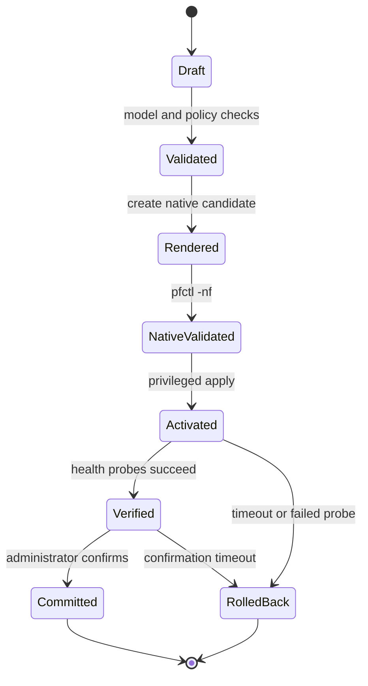

# Configuration lifecycle

Status: **proposed**, with an audited render–stage–validate–store preparation
path implemented.

Gatehold treats a configuration change as a transaction with explicit stages.
No caller may skip directly from user input to privileged activation.

## Lifecycle

## Stage guarantees

### Draft

The desired state consists only of versioned, typed Gatehold objects. The
configuration does not accept arbitrary PF text. Every object carries a stable
identifier so validation, audit events, and user-visible errors can refer to the
same subject.

### Model validation

Portable validation rejects malformed or unsafe values before any native file
is created. The current prototype validates rule identifiers, descriptions,
interface names, numeric IP networks, address families, protocol/port
combinations, and duplicate IDs.

Validation is fail-closed: if any issue exists, the PF renderer returns no
candidate text. Stable `GH-CFG-*` codes make failures testable and diagnosable.

### Render

The renderer maps enumerated domain values to known PF tokens. It never copies
an action, direction, family, or protocol from free-form text. Textual fields
that reach output are constrained before rendering. Output is deterministic for
the same ordered input and includes the configuration revision.

### Native validation

The implemented staging component writes candidates below a trusted,
controller-owned directory using directory-relative file creation, write-once
semantics, and private permissions. The native adapter executes `pfctl -nf`
without a shell, using an absolute executable path and an argument vector.

The adapter enforces a timeout, captures bounded output, distinguishes accepted,
rejected, timed-out, unsafe-candidate, and execution-error results, and assigns
stable event IDs. Linux CI uses a controlled substitute; the same path must be
tested against `/sbin/pfctl` on OpenBSD before this stage is considered complete.

### Activation

Only the small privileged controller may activate a natively validated
candidate. The API and web user interface will request a narrowly scoped
operation over a local socket; they will not receive arbitrary command
execution or filesystem access.

### Verification and confirmation

Health probes will check the expected management path, selected data paths,
PF status, and affected services. High-risk changes enter a pending-confirmation
state with a monotonic deadline.

### Commit or rollback

Explicit confirmation promotes the candidate to the last known-good revision.
A failed probe, controller restart, or expired confirmation timer restores the
previous revision. Rollback must not depend on the web session that requested
the change.

## Audit events

Each transition emits a structured event with an operation ID, stable event ID,
revision, stage, outcome, and sanitized context. Secrets and packet payloads are
never valid event attributes. See the [event-format reference](../reference/event-format.md).

The implemented preparation service writes a durable intent event before
staging and native validation. It writes the result before moving forward. If
the journal cannot safely append, the service fails closed and begins no later
stage. A successful preparation currently produces nine correlated events from
`GH-OP-0001` through `GH-OP-0006`, including staging, native-validation, and
immutable-revision result events between them.

## Current implementation boundary

Implemented now:

- typed in-memory firewall rules;
- portable validation and stable error codes;
- deterministic rendering of a deliberately small PF subset;
- rejection without partial output;
- secure, private, write-once candidate staging;
- direct native-validator execution without shell interpretation;
- validation timeout and bounded diagnostic capture;
- append-only, synchronized JSONL operation journal;
- fail-closed orchestration across render, stage, and native validation;
- immutable persistence of natively validated revisions;
- atomic last-known-good marker primitives, kept separate from preparation;
- structured event serialization and attribute-key redaction;
- unit tests for successful and hostile inputs.

Not yet implemented:

- persisted administrator configuration and schema migrations;
- completed real-OpenBSD integration tests for `/sbin/pfctl -nf`;
- trusted journal rotation and tamper-evidence;
- privileged activation;
- service and connectivity probes;
- confirmation timer, durable recovery journal, and rollback.

The last-known-good marker must not be advanced by preparation. Its future
transition belongs after activation, health verification, and confirmation. A
failed or unconfirmed activation will instead load the previously marked
revision for rollback.
