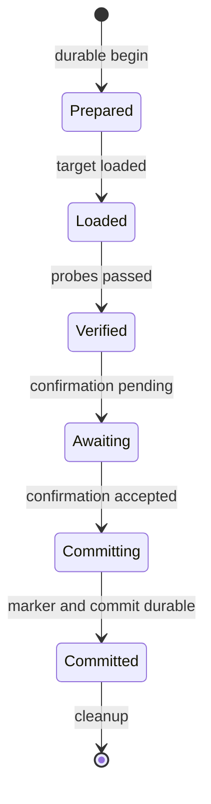

# Pending activation transaction

Status: **experimental**

The pending-activation store is the durable safety state for one PF activation.
It is separate from the append-only audit journal and immutable revision store.

## File and trust boundary

The store manages one file named `pending-activation` below an absolute,
controller-owned directory that is not writable by group or others. The file is
a private regular file, opened with no-follow semantics, and limited to 1 KiB.

Creation first writes and synchronizes a unique private temporary file. A
same-directory `linkat` publishes it without replacement; therefore exactly one
concurrent creator wins. Phase updates use synchronized temporary files and
atomic rename. Create, update, and clear synchronize the containing directory.

## Version 1 format

```text
gatehold-activation-v1
operation_id=activate-revision-42
target_revision=42
rollback_revision=41
phase=prepared_for_load
```

The parser requires exactly these five newline-terminated lines in this order.
Unknown versions, fields, phases, extra lines, zero/equal revisions, unsafe IDs,
oversized files, and symbolic links are rejected.

## State progression



No state may be skipped or moved backward. Ordinary failure paths restore the
rollback revision and then clear the record.

## Startup recovery

| Record state | Recovery action |
|---|---|
| No record | Return `no_pending`; no PF operation |
| Any phase before `committed` | Revalidate and load rollback revision, restore marker, clear record |
| `committed` and marker equals target | Preserve active target and clear stale record |
| `committed` but marker differs | Stop with critical inconsistency |
| Malformed, unsafe, or dangling data | Stop without guessing or loading PF |

Recovery attempts the safety action even when the audit journal is unavailable.
It reports `audit_failed_recovered` when restoration succeeded without durable
audit evidence.

## Event identifiers

| Event ID | Meaning |
|---|---|
| `GH-TXN-0001` | Pending transaction created |
| `GH-TXN-0002` | Phase advanced |
| `GH-TXN-0003` | Pending transaction loaded |
| `GH-TXN-0004` | Pending transaction cleared |
| `GH-TXN-0005` | No pending transaction exists |
| `GH-TXN-1001`–`1007` | Invalid, unsafe, conflicting, or out-of-order state |
| `GH-TXN-2001`–`2006` | Create, update, read, clear, or synchronization failure |
| `GH-REC-0001` | Startup recovery began |
| `GH-REC-0002` | Incomplete activation rolled back |
| `GH-REC-0003` | Stale committed record cleaned up |
| `GH-REC-2001/2002` | Committed-state mismatch or unavailable rollback revision |

## Current boundary

The experimental controller lifecycle calls the recovery API before activation
dispatch and is failure-injection tested. No production daemon entry point calls
that lifecycle yet, so operators must not enable real PF activation. The file is
a durable conflict guard, not an OS-held advisory lock or cryptographic
integrity proof.
