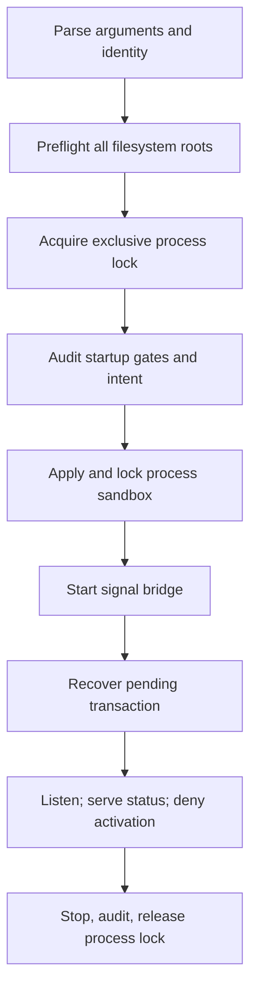

# Privileged controller daemon

Status: **experimental read-only bootstrap; isolated labs only**

`gateholdd` is the first executable composition of controller recovery, local
peer authentication, serial admission, cooperative stop, and secure listener
cleanup. It stays in the foreground and authorizes no new PF activation.

## Invocation

```console
gateholdd serve-read-only \
  --journal-root /var/log/gatehold \
  --revision-root /var/db/gatehold/revisions \
  --transaction-root /var/db/gatehold/transactions \
  --socket-path /var/run/gatehold/controller.sock \
  --allowed-uid 1001 \
  --allowed-gid 1001
```

All directories must already exist, be owned by the effective daemon identity,
deny writes by group and other users, and resolve canonically to the exact
configured paths without symlink aliases. The socket parent additionally
denies every permission to other users and group write. The three storage roots
must not be equal, ancestors, or descendants of one another. The socket parent
must not overlap a storage root.

`--allowed-uid` is mandatory. `--allowed-gid` adds an exact group requirement.
Names are deliberately unsupported: service-account name resolution belongs to
installation tooling, not the privileged process.

Without `--allowed-gid`, the allowed UID must equal the daemon's effective UID
and the socket is mode `0600`. With `--allowed-gid`, that GID must equal the
daemon's effective GID when the daemon is unprivileged. A root daemon may
instead delegate the bound socket to that exact GID with `fchownat()` before
setting mode `0660`; this permits a separate API UID without adding it to a
privileged controller group. Filesystem permissions provide reachability while
the kernel peer policy still enforces the exact configured UID and GID.
Inconsistent identity and socket-permission settings fail with `GH-DMN-1002`
or `GH-DMN-1003` before recovery or listener startup. The group-accessible
socket parent must belong to the configured API group and allow group
traversal, while remaining owned by the daemon and not group-writable.

The process does not accept a `pfctl` option and always uses `/sbin/pfctl`.
Unknown, duplicated, missing, signed, non-numeric, relative, non-normalized, and
overlapping arguments are rejected before journal or firewall access.

## Runtime behavior



Preflight checks the journal, revision, transaction, and socket directories in
that order before signal handling or recovery. It compares canonical paths,
ownership, permissions, and opened directory identities, then requires the
socket target to be absent. Component-local checks still run when each root is
used. Gatehold never removes an occupied socket path during startup.

After preflight, the daemon creates or opens `.gateholdd.lock` inside the
transaction root and attempts a nonblocking exclusive lock. The entry must be a
private, single-link regular file owned by the effective UID. The descriptor is
held through final shutdown audit; process exit releases the kernel lock, while
the empty file remains. A second daemon using the same transaction root fails
before controller construction and recovery. Operators must not delete this
file while a daemon may be running.

On OpenBSD, the daemon next unveils only the audit root (`rwc`), revision root
(`r`), transaction root (`rwc`), socket parent (`rwc`), `/sbin/pfctl` (`x`),
and `/dev/pf` (`rw`), then permanently locks that view. The parent normally
pledges `stdio rpath wpath cpath fattr flock unix proc exec`; `chown` is added
only when a configured API group must be assigned to the newly bound socket.
Sandbox setup failures are
fatal before signal startup or recovery. The fixed `pfctl` child inherits the
locked filesystem view but intentionally starts without parent-supplied pledge
promises until a native OpenBSD recovery test proves a safe helper policy.

On non-OpenBSD development platforms, `GH-SBX-1001` explicitly records that no
sandbox is enforced. Such a binary is test-only and must not run as a
privileged service.

The listener may expose a `ready`, `read_only`, or `blocked` controller state
after recovery. Only status is operationally useful in this bootstrap. Every
activation reaches the real lifecycle and activation service, but the installed
authorizer returns `authorization_denied` before native validation or mutation.

Recovery may restore a last-known-good PF revision when a durable pending
transaction exists. This is required fail-safe reconciliation and is the only
PF-changing path in `serve-read-only` mode.

## Exit status

| Code | Meaning |
|---:|---|
| `0` | Cooperative clean shutdown |
| `2` | Command or argument validation failed |
| `3` | Startup, journal, signal, or internal initialization failed |
| `4` | Controller service or listener failed |
| `5` | Signal cleanup or final audit failed |

## Stable daemon events

| Event ID | Meaning |
|---|---|
| `GH-DMN-0001` | Deny-all daemon startup intent |
| `GH-DMN-0002` | Daemon reached its terminal shutdown path |
| `GH-DMN-0003` | All configured daemon filesystem roots passed preflight |
| `GH-DMN-0004` | Exclusive daemon process lock acquired |
| `GH-DMN-1001` | Command or arguments invalid; emitted to standard error only |
| `GH-DMN-1002` | Peer identity cannot access the selected socket mode |
| `GH-DMN-1003` | A configured directory is missing, aliased, misowned, or unsafe |
| `GH-DMN-1004` | The configured controller socket path is already occupied |
| `GH-DMN-1005` | Another daemon owns the transaction-root process lock |
| `GH-DMN-1006` | Process-lock root or entry is unsafe |
| `GH-DMN-2001` | Startup intent could not be audited |
| `GH-DMN-2002` | Filesystem identity or availability could not be verified |
| `GH-DMN-2003` | Process-lock inspection or acquisition encountered I/O uncertainty |
| `GH-DMN-2004` | Termination signal or final shutdown could not be audited |
| `GH-DMN-2005` | Unhandled internal failure reached the process boundary |
| `GH-SBX-0001` | OpenBSD process sandbox applied and locked |
| `GH-SBX-1001` | Sandbox unsupported on the non-target development platform |
| `GH-SBX-1002` | Internal sandbox policy failed validation before system calls |
| `GH-SBX-2001` | An unveil rule could not be installed |
| `GH-SBX-2002` | The unveil rules could not be permanently locked |
| `GH-SBX-2003` | The parent pledge could not be installed |

Nested `GH-CTL-*`, `GH-SVC-*`, `GH-LSN-*`, `GH-IPC-*`, `GH-SIG-*`, and
`GH-AUTH-*` events retain their component meanings. Standard error does not
contain paths, authorization references, native command output, or request
payloads.

## Verification boundary

Portable tests cover strict argument parsing, directory ownership, permissions,
aliases, group access, occupied targets, lock-file safety, cross-process
contention, exact sandbox policy and ordering, every partial sandbox failure,
deny-all behavior before any validator or transaction, and CLI help/version.
The child-process test proves that an unsafe root and a competing
daemon are durably rejected before startup and recovery. Where filesystem Unix
sockets are available, it then exchanges status and denied activation
frames, sends real `SIGTERM`, verifies exit status and socket removal, and
checks the journal for secret-free lifecycle evidence. Restricted runtimes skip
only this live-socket portion.

The executable is not production-ready until the sandbox and recovery path pass
native OpenBSD process tests, and `rc.d` packaging, dedicated identities,
credential reduction, per-identity admission fairness, a constrained `pfctl`
helper, and a reviewed authorization architecture are implemented.
