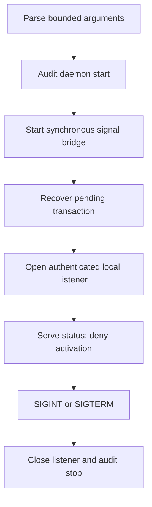

# Privileged controller daemon

Status: **experimental read-only bootstrap; isolated labs only**

`gateholdd` is the first executable composition of controller recovery, local
peer authentication, serial admission, cooperative stop, and secure listener
cleanup. It stays in the foreground and authorizes no new PF activation.

## Invocation

```console
gateholdd serve-read-only \
  --journal-root /var/log/gatehold \
  --revision-root /var/db/gatehold/revisions \
  --transaction-root /var/db/gatehold/transactions \
  --socket-path /var/run/gatehold/controller.sock \
  --allowed-uid 1001 \
  --allowed-gid 1001
```

All directories must already exist, be private, be owned by the effective
daemon identity, and resolve without symlink aliases according to the component
that owns them. The three storage roots must not be equal, ancestors, or
descendants of one another. The socket parent must not overlap a storage root.

`--allowed-uid` is mandatory. `--allowed-gid` adds an exact group requirement.
Names are deliberately unsupported: service-account name resolution belongs to
installation tooling, not the privileged process.

Without `--allowed-gid`, the allowed UID must equal the daemon's effective UID
and the socket is mode `0600`. With `--allowed-gid`, that GID must equal the
daemon's effective GID and the socket is mode `0660`; this permits a separate
allowed UID in the daemon's dedicated IPC group. Filesystem permissions provide
reachability while the kernel peer policy still enforces the exact configured
UID and GID. Inconsistent identity and socket-permission settings fail with
`GH-DMN-1002` before listener startup.

The process does not accept a `pfctl` option and always uses `/sbin/pfctl`.
Unknown, duplicated, missing, signed, non-numeric, relative, non-normalized, and
overlapping arguments are rejected before journal or firewall access.

## Runtime behavior



The listener may expose a `ready`, `read_only`, or `blocked` controller state
after recovery. Only status is operationally useful in this bootstrap. Every
activation reaches the real lifecycle and activation service, but the installed
authorizer returns `authorization_denied` before native validation or mutation.

Recovery may restore a last-known-good PF revision when a durable pending
transaction exists. This is required fail-safe reconciliation and is the only
PF-changing path in `serve-read-only` mode.

## Exit status

| Code | Meaning |
|---:|---|
| `0` | Cooperative clean shutdown |
| `2` | Command or argument validation failed |
| `3` | Startup, journal, signal, or internal initialization failed |
| `4` | Controller service or listener failed |
| `5` | Signal cleanup or final audit failed |

## Stable daemon events

| Event ID | Meaning |
|---|---|
| `GH-DMN-0001` | Deny-all daemon startup intent |
| `GH-DMN-0002` | Daemon reached its terminal shutdown path |
| `GH-DMN-1001` | Command or arguments invalid; emitted to standard error only |
| `GH-DMN-1002` | Peer identity cannot access the selected socket mode |
| `GH-DMN-2001` | Startup intent could not be audited |
| `GH-DMN-2004` | Termination signal or final shutdown could not be audited |
| `GH-DMN-2005` | Unhandled internal failure reached the process boundary |

Nested `GH-CTL-*`, `GH-SVC-*`, `GH-LSN-*`, `GH-IPC-*`, `GH-SIG-*`, and
`GH-AUTH-*` events retain their component meanings. Standard error does not
contain paths, authorization references, native command output, or request
payloads.

## Verification boundary

Portable tests cover strict argument parsing, deny-all behavior before any
validator or transaction, CLI help/version, and an end-to-end child-process
test. The latter starts `gateholdd`, exchanges status and denied activation
frames, sends real `SIGTERM`, verifies exit status and socket removal, and
checks the journal for secret-free lifecycle evidence. Restricted runtimes that
deny filesystem Unix sockets explicitly skip only that end-to-end test.

The executable is not production-ready until native OpenBSD process tests,
`rc.d` packaging, dedicated identities, privilege reduction, `pledge()` and
`unveil()` policies, connection-rate controls, and a reviewed authorization
architecture are implemented.
